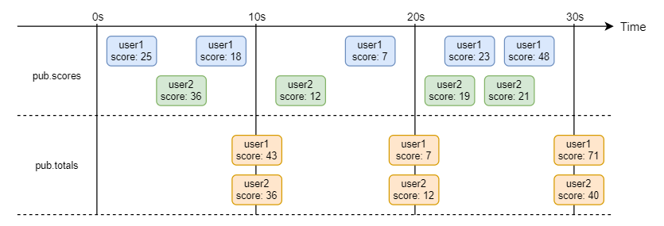
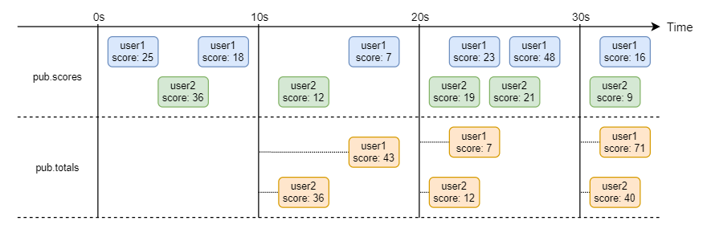

[](https://github.com/rogervinas/spring-cloud-stream-kafka-streams-first-steps/actions/workflows/ci.yml)


# Spring Cloud Stream & Kafka Streams Binder first steps

[Spring Cloud Stream](https://spring.io/projects/spring-cloud-stream) is the solution provided by **Spring** to build applications connected to shared messaging systems.

It offers an abstraction (the **binding**) that works the same whatever underneath implementation we use (the **binder**):
* **Apache Kafka**
* **Rabbit MQ**
* **Kafka Streams**
* **Amazon Kinesis**
* ...

You can also check out [Spring Cloud Stream Kafka step by step](https://github.com/rogervinas/spring-cloud-stream-step-by-step) where I got working a simple example using **Kafka binder**.

Let's try this time a simple example using **Kafka Streams binder**! 🤩

* [First steps](#first-steps)
* [Goal](#goal)
* [Integration Test](#integration-test)
* [Kafka Streams binder configuration](#kafka-streams-binder-configuration)
* [TotalScoreProcessor first implementation](#totalscoreprocessor-first-implementation)
* [TotalScoreProcessor test using kafka-streams-test-utils](#totalscoreprocessor-test-using-kafka-streams-test-utils)
* [Final implementation](#final-implementation)
* [Test this demo](#test-this-demo)
* [Run this demo](#run-this-demo)
* See also
  * :octocat: [Spring Cloud Stream Kafka step by step](https://github.com/rogervinas/spring-cloud-stream-kafka-step-by-step)
  * :octocat: [Spring Cloud Stream & Kafka Confluent Avro Schema Registry](https://github.com/rogervinas/spring-cloud-stream-kafka-confluent-avro-schema-registry)
  * :octocat: [Spring Cloud Stream Multibinder](https://github.com/rogervinas/spring-cloud-stream-multibinder)
  * :octocat: [Spring Cloud Stream & Kafka Streams Binder + Processor API](https://github.com/rogervinas/spring-cloud-stream-kafka-streams-processor)

You can browse older versions of this repo:
* [Spring Boot 2.x](https://github.com/rogervinas/spring-cloud-stream-kafka-streams-first-steps/tree/spring-boot-2.x)

## First steps

A bit of documentation to start with:

* [Spring Cloud Kafka Streams Binder](https://cloud.spring.io/spring-cloud-stream-binder-kafka/spring-cloud-stream-binder-kafka.html#_kafka_streams_binder)
* [Kafka Streams Documentation](https://kafka.apache.org/documentation/streams/)
  * [Kafka Streams Developer Guide](https://kafka.apache.org/documentation/streams/developer-guide/)
  * [Kafka Streams DSL](https://kafka.apache.org/documentation/streams/developer-guide/dsl-api.html)
  * [Testing Kafka Streams](https://kafka.apache.org/documentation/streams/developer-guide/testing.html)

## Goal

We want to implement this flow:



1. We receive messages with key = username and value = { score: number } from topic **pub.scores**
2. We have to calculate the **total score** received by username on fixed windows of 10 seconds and send it to topic **pub.totals**

## Integration Test

First we create a project using this [spring initializr configuration](https://start.spring.io/#!type=gradle-project&language=kotlin&packaging=jar&groupId=com.rogervinas&artifactId=springcloudstreamkafkastreamsbinder&name=springcloudstreamkafkastreamsbinder&description=Spring%20Cloud%20Streams%20%26%20Kafka%20Streams%20Binder&packageName=com.rogervinas.springcloudstreamkafkastreamsbinder&dependencies=cloud-stream) and we add **Kafka Streams** binder dependency **spring-cloud-stream-binder-kafka-streams**.

Using [testcontainers](https://www.testcontainers.org/) and [docker-compose](docker-compose.yml) with a **Kafka** container, we write the following **integration test**:

```kotlin
@Test
fun `should publish total scores`() {
  kafkaProducerHelper.send(TOPIC_SCORES, USERNAME_1, "{\"score\": 10}")
  kafkaProducerHelper.send(TOPIC_SCORES, USERNAME_2, "{\"score\": 20}")
  kafkaProducerHelper.send(TOPIC_SCORES, USERNAME_1, "{\"score\": 30}")
  kafkaProducerHelper.send(TOPIC_SCORES, USERNAME_2, "{\"score\": 40}")
  kafkaProducerHelper.send(TOPIC_SCORES, USERNAME_1, "{\"score\": 50}")
  kafkaProducerHelper.send(TOPIC_SCORES, USERNAME_2, "{\"score\": 60}")

  Thread.sleep(totalScoreWindow.plusSeconds(1).toMillis())

  // Send at least one more message so the previous window is closed
  kafkaProducerHelper.send(TOPIC_SCORES, USERNAME_1, "{\"score\": 1}")
  kafkaProducerHelper.send(TOPIC_SCORES, USERNAME_2, "{\"score\": 1}")

  val records = kafkaConsumerHelper.consumeAtLeast(2, Duration.ofMinutes(1))

  assertThat(records).hasSize(2)
  assertThat(records.associate { record -> record.key() to record.value() }).satisfies { valuesByKey ->
    JSONAssert.assertEquals("{\"totalScore\": 90}", valuesByKey[USERNAME_1], true)
    JSONAssert.assertEquals("{\"totalScore\": 120}", valuesByKey[USERNAME_2], true)
  }
}
```

This test will obviously fail, but it should work once we have finished our implementation.

Note that we have to send another message after the window has expired to force **Kafka Streams** close the window.
It is the only way for **Kafka Streams** to be sure that there are no more messages left for that window.
In other words, what we are really implementing is:



## Kafka Streams binder configuration

Next we configure the **Kafka Streams binder**:

```yaml
spring:
  application:
    name: "spring-cloud-stream-kafka-streams-first-steps"
  cloud:
    function:
      definition: totalScoreProcessor
    stream:
      bindings:
        totalScoreProcessor-in-0:
          destination: "pub.scores"
        totalScoreProcessor-out-0:
          destination: "pub.totals"
      kafka:
        streams:
          binder:
            applicationId: "${spring.application.name}"
            brokers: "localhost:9094"
            configuration:
              default:
                key.serde: org.apache.kafka.common.serialization.Serdes$StringSerde
                value.serde: org.apache.kafka.common.serialization.Serdes$StringSerde
```

With this configuration:
* **Spring Cloud Stream** will create a **Kafka Streams binder** connected to **localhost:9094**
* We need to create a **@Bean** named **totalScoreProcessor** that should implement `Function<KStream, KStream>` interface
  * This **@Bean** will connect a **KStream** subscribed to **pub.scores** topic to another **KStream** publishing to **pub.totals** topic

You can find all the available configuration properties documented in [Kafka Streams Properties](https://cloud.spring.io/spring-cloud-stream-binder-kafka/spring-cloud-stream-binder-kafka.html#_kafka_streams_properties).

## TotalScoreProcessor first implementation

We can start with a simple implementation for a **TotalScoreProcessor** that for every **ScoreEvent** received will generate a **TotalScoreEvent** with the same value:

```kotlin
data class ScoreEvent(val score: Int)
data class TotalScoreEvent(val totalScore: Int)

class MyTotalScoreProcessor(private val window: Duration) : Function<KStream<String, ScoreEvent>, KStream<String, TotalScoreEvent>> {
  override fun apply(input: KStream<String, ScoreEvent>): KStream<String, TotalScoreEvent> {
      return input.map { key, scoreEvent -> KeyValue(key, TotalScoreEvent(scoreEvent.score)) }
  }
}

@Configuration
class MyApplicationConfiguration {
  @Bean
  fun totalScoreProcessor(): Function<KStream<String, ScoreEvent>, KStream<String, TotalScoreEvent>> 
    = MyTotalScoreProcessor()
}
```

💡 We are using **Spring Cloud Stream**'s default serialization/deserialization of **Kotlin** data classes to Json. In order for this to work we need to add **com.fasterxml.jackson.module:jackson-module-kotlin** dependency.

This implementation is not fulfilling our goal yet, just execute [MyApplicationIntegrationTest](src/test/kotlin/com/rogervinas/kafkastreams/MyApplicationIntegrationTest.kt) and see it still failing! 😓

## TotalScoreProcessor test using kafka-streams-test-utils

Using the [Test Pyramid](https://martinfowler.com/articles/practical-test-pyramid.html#TheTestPyramid) principle we should use **integration tests** to test the simple test cases and test the more complicated ones using **unit tests** (if not **unit tests** at least less "integrated" tests).

To create these less "integrated" tests we can use [kafka-streams-test-utils](https://kafka.apache.org/documentation/streams/developer-guide/testing.html).

They will be faster and more reliable (not needing **Kafka**) and with some cool features like "advance time" to simulate messages published at different instants in time.

Here it is one way to create a **TopologyTestDriver** from [kafka-streams-test-utils](https://kafka.apache.org/documentation/streams/developer-guide/testing.html) to test our **TotalScoreProcessor**:

```kotlin
@BeforeEach
fun beforeEach() {
  val stringSerde = Serdes.StringSerde()
  val scoreEventSerializer = JsonSerde(ScoreEvent::class.java).serializer()
  val totalScoreEventDeserializer = JsonSerde(TotalScoreEvent::class.java).deserializer()
  val streamsBuilder = StreamsBuilder()

  // This way we test MyTotalScoreProcessor
  MyTotalScoreProcessor()
    .apply(streamsBuilder.stream(TOPIC_IN))
    .to(TOPIC_OUT)

  val config = Properties().apply {
    setProperty(StreamsConfig.DEFAULT_KEY_SERDE_CLASS_CONFIG, stringSerde.javaClass.name)
    setProperty(StreamsConfig.DEFAULT_VALUE_SERDE_CLASS_CONFIG, JsonSerde::class.java.name)
    setProperty(StreamsConfig.APPLICATION_ID_CONFIG, "test")
    setProperty(StreamsConfig.BOOTSTRAP_SERVERS_CONFIG, "test-server")
    setProperty(JsonDeserializer.TRUSTED_PACKAGES, "*")
  }
  val topology = streamsBuilder.build()
  topologyTestDriver = TopologyTestDriver(topology, config)
  topicIn = topologyTestDriver.createInputTopic(TOPIC_IN, stringSerde.serializer(), scoreEventSerializer)
  topicOut = topologyTestDriver.createOutputTopic(TOPIC_OUT, stringSerde.deserializer(), totalScoreEventDeserializer)
}
```

And then we can write tests like this one:

```kotlin
@Test
fun `should publish total score of one username when window expires`() {
  topicIn.pipeInput(USERNAME_1, ScoreEvent(25))
  topicIn.pipeInput(USERNAME_1, ScoreEvent(37))
  topicIn.pipeInput(USERNAME_1, ScoreEvent(13))

  topicIn.advanceTime(TOTAL_SCORE_WINDOW.plusMillis(100))

  // Send at least one more message so the previous window is closed
  topicIn.pipeInput(USERNAME_1, ScoreEvent(1))

  assertThat(topicOut.readKeyValuesToList()).singleElement().satisfies { topicOutMessage ->
    assertThat(topicOutMessage.key).isEqualTo(USERNAME_1)
    assertThat(topicOutMessage.value).isEqualTo(TotalScoreEvent(75))
  }
}
```

## Final implementation

After a few iterations your **TotalScoreProcessor** implementation should look similar to this:

```kotlin
override fun apply(input: KStream<String, ScoreEvent>): KStream<String, TotalScoreEvent> {
  return input
    .groupByKey()
    .windowedBy(TimeWindows.ofSizeAndGrace(totalScoreWindow, Duration.ZERO))
    .aggregate(
      { TotalScoreEvent(0) },
      { _, scoreEvent, totalScoreEvent -> TotalScoreEvent(scoreEvent.score + totalScoreEvent.totalScore) },
      Materialized.`as`<String?, TotalScoreEvent?, WindowStore<Bytes, ByteArray>?>("total-score")
        .withKeySerde(Serdes.StringSerde())
        .withValueSerde(JsonSerde(TotalScoreEvent::class.java))
    )
    .suppress(Suppressed.untilWindowCloses(unbounded()))
    .toStream()
    .map { key, value -> KeyValue(key.key(), value) }
}
```

Note that we use the [suppression operator](https://kafka.apache.org/27/documentation/streams/developer-guide/dsl-api.html#window-final-results) to emit nothing for a window until it closes, and then emit the final result. If we were not using it we would have an output message for each input message.

Now you can play around with [Kafka Streams DSL](https://kafka.apache.org/documentation/streams/developer-guide/dsl-api) and do more complicated stuff!

Happy coding! 💙

## Test this demo

```shell
./gradlew test
```

## Run this demo

```shell
docker-compose up -d
./gradlew bootRun
docker-compose down
```

Then you can use [kcat](https://github.com/edenhill/kcat) to produce/consume to/from **Kafka**:
```shell
# consume
kcat -b localhost:9094 -C -t pub.scores -f '%k %s\n'
kcat -b localhost:9094 -C -t pub.totals -f '%k %s\n'

# produce
echo 'john:{"score":100}' | kcat -b localhost:9094 -P -t pub.scores -K:
```
